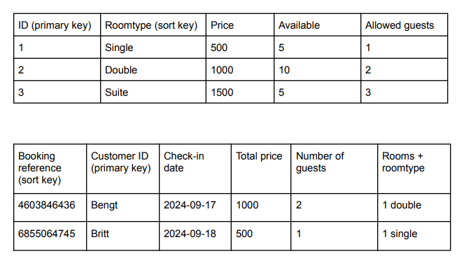

# Bonzai Backend

### A project by

- [annatbg](https://github.com/annatbg)
- [rebeckaelin](https://github.com/rebeckaelin)
- [Ahmed-a287](https://github.com/Ahmed-a287)

### Database relationships

### Endpoints

GET - https://zyfeqi0n9g.execute-api.eu-north-1.amazonaws.com/rooms/{type}
POST - https://zyfeqi0n9g.execute-api.eu-north-1.amazonaws.com/rooms
DELETE - https://zyfeqi0n9g.execute-api.eu-north-1.amazonaws.com/bookings/{id}
GET - https://zyfeqi0n9g.execute-api.eu-north-1.amazonaws.com/bookings/{booking}
POST - https://zyfeqi0n9g.execute-api.eu-north-1.amazonaws.com/bookings
